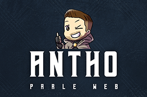

# Antho parle web - Web Socket contest



## Objectif
- Mise en place d'une expérience créative et interactive via l'utilisation de la technologie Websocket
- Pour l'animation :
    - tous types de context canvas autorisés (2D, WebGL, WebGL2, etc )
    - utilisation de librairies et frameworks tierces autorisés (THREE / PIXI / GSAP / etc)

## Démo
https://patmuw.onivers.com

## Installation

Installation de la dépendance :

```
npm install
```

- Ouvrir un premier terminal pour lancer le serveur websocket (le garder ouvert)

```
npm run serve

```

Lancer un "live-server" (extention VS code) dans le dossier "front/" pour ouvrir automatiquement le front dans votre browser et tester la chose
